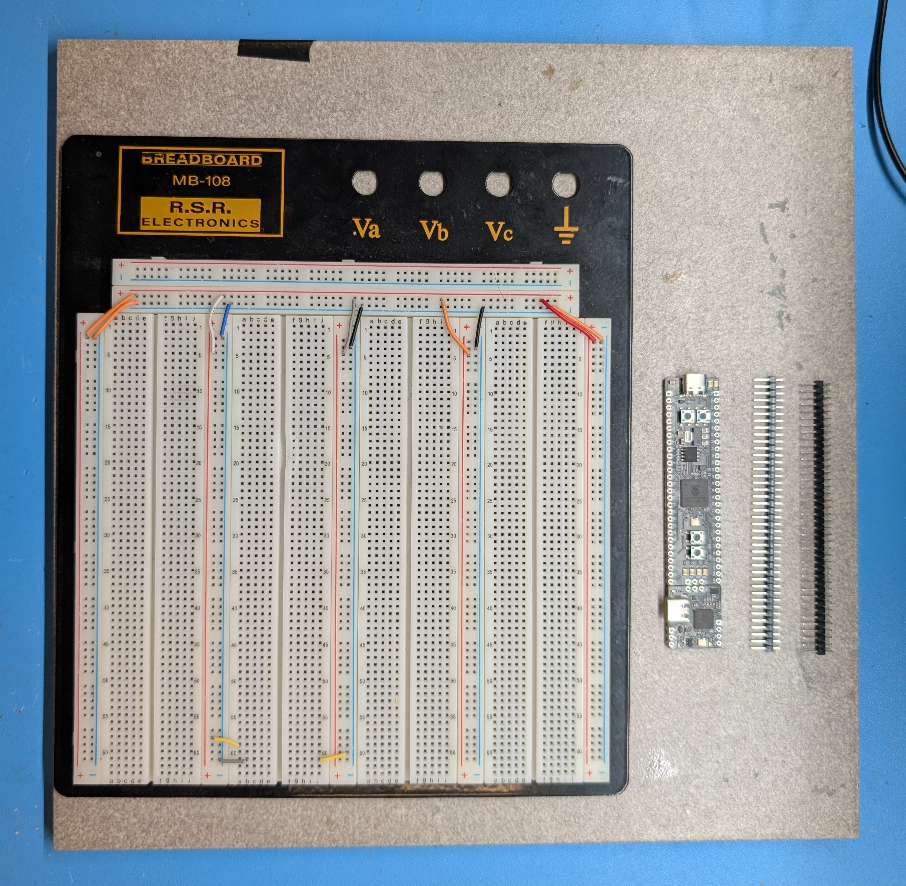
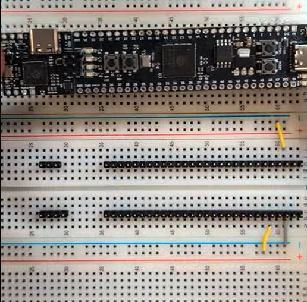

## Soldering pin headers to your Proton board

### Tools and materials needed
- Your brand new Purdue Proton board
- Two 60-pin pin headers
- Your breadboard
- Soldering iron
- Solder
- Flux

> [!CAUTION]
> **Safety first!**
> - Ensure the soldering is turned OFF. 
> - Ensure the fume hood is turned ON so that it pulls fumes away from your face.
> - Ensure the soldering iron is in its holder.

You should have your components in front of you, as shown below.

Take one of the row header and break it as follows:
- 1 4-pin header
    - This will be used as the debug and boot pins on the Proton debugger.
- 3 3-pin headers
    - One will be used as the UART pins on the Proton debugger.
    - The other two will be used to connect the debugger to the Proton board, using the holes on both sides of the line joining the Proton board and the debugger.
- 1 28-pin header
    - This will populate the holes on the Proton board on one side.

Then, take the other row header and break off 56 pins so that it goes in on the other side of the Proton board.  Use the board itself to help you properly count the pins.

> [!TIP]
> If you accidentally break off fewer pins, you can still solder on the smaller piece and add the extra pins separately.

Next, place the headers into the breadboard in the positions indicated.  With the head of the breadboard (where the title and voltage plug holders are) turned left, you will (eventually) place the Proton board on the third row from the top with the top of the Proton board facing outward.  

For now, however, we'll put down the pin headers in their place instead, using the breadboard to ensure proper alignment.  Note how the board is now aligned with the pin header layout as shown.

We'll solder these last.

Now, take two of the 3-pin headers, and place them into the Proton board in the 2x3 pin positions as shown below, but **upside down**, and insert the pins into the breadboard.  This will allow us to more easily hold the board in place as we start soldering the 2x3 header.  The video below shows exactly how to do this.

<video src="https://media.githubusercontent.com/media/ece362-purdue/pico-labs/main/lab0-intro/images/soldering-pin2x3.webm"
       controls
       autoplay
       loop
       muted
       width="640"
       height="360">