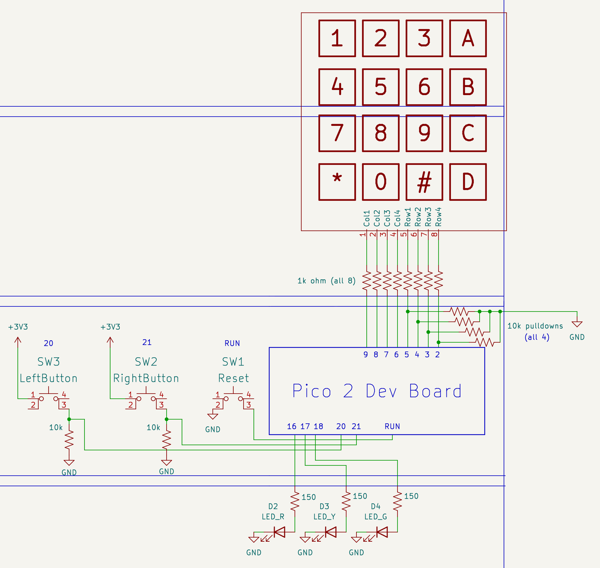
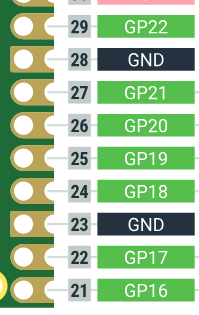
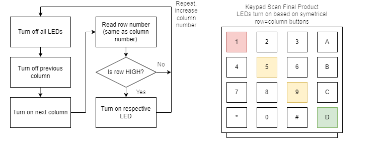

# Lab 1
## General Purpose I/O

### Table of Contents
<br>

| Step | Description | Points |
|------|-------------|--------|
| 0.1 | Set up your environment |   |
| 0.2 | Wire and organize your breadboard |   |
| 1 | Read the datasheet | 10 |
| 2 | Configure output LEDs | 10 |
| 3 | Configure input pushbuttons | 10 |
| 5 | Configure and poll a keypad | 20 |
| 7 | In-Lab Checkoff Step | 20* |
| &nbsp; | Total: | 100 |
<br>

\* - You must get your whole lab checked off before the end of your lab section to avoid a late penalty of 20%.

## Instructional Objectives
- To learn how to find relevant information in a microcontroller datasheet.
- To learn how to interface with LEDs, push buttons and a keypad using GPIO pins.
- To learn how to trigger code execution when an external event occurs.

> [!IMPORTANT]
> By now, your breadboard should have been signed with a silver sharpie with your username and the signature of the TA.  If you have not yet done this, please notify a TA and get it signed as soon as possible.  **Failure to do so by lab 2 will result in a zero for the lab currently running in that week.**
> 
> Keep in mind the food-and-liquids policy of the lab, which is to bring absolutely no food or liquid with you to your lab sessions.  If you must bring it, keep it under the window in the back of BHEE 160.  **Failure to follow this rule will result in a penalty.** 
> 
> Similar to 270, 362 labs should be started at home, and checked off in lab.  **Do not wait to start your lab in your lab section, or you will not finish.**  You must be checked off for all steps in lab to receive full credit.

> [!NOTE]
If at any point you need to get checked off, or need to get help, you can add yourself to the [lab queue](https://engineering.purdue.edu/~menon18/queup/?room=36200).  **Bookmark this link in your lab machine browser.**

## General Purpose Input/Output (GPIO)

In this experiment, you will learn how to connect simple input devices (push buttons and keypad) and output devices (LEDs) to your Pico 2 development board. 

The basic idea behind GPIO is to interface the microcontroller to external components.  The pins of your microcontroller are, first and foremost, GPIO pins, which means that they can take on one of three functionalities:

1. Input: The pin can **read** a voltage level from an external component.  This is useful for reading the state of a button, or the output of a sensor.

2. Output: The pin can **drive** a voltage level to an external component.  This is useful for turning on an LED in series with a resistor, or engaging an actuator.

3. Alternate Function: The pin can be used for a unique purpose that is not strictly input or output.  This is useful for allowing other peripherals on the microcontroller, such as UART, SPI, ADC/DAC, etc. to use the pin for their own purposes.

## Step 0.1: Set up your environment

Make sure to clone the code repository from GitHub Classroom.  Keep in mind to add, commit and push any changes you make so that your work is accessible from a lab machine. 

> [!CAUTION]
> **If you have not set up VScode with the Pico extension as described in Lab 0 on BOTH your physical machine and your lab machine, we strongly recommend that you do that now.  Having two working environments provides you the necessary redundancy to ensure you can still work in case one environment randomly stops working, and you can use `git` to back up your work and seamlessly transition to the other machine.  Please do not assume this will not happen to you, because it absolutely can.**

In addition, a precompiled autotest object has been incorporated into the template folder.  You can utilize it to test the subroutines (another word for functions). To do so, make sure you have connected the UART serial adapter and the STLink to the microcontroller. Then you will need to uncomment the line `autotest()` in the `main.c` file and start the debugging on System Workbench. After the debugger successfully launches, make sure it goes into the `autotest()`, and launch a serial connection to the microcontroller in a terminal by clicking "Upload and Monitor" in the PlatformIO tab (the same one in lab 0).  

If you are on Windows, take care to select the correct COM port in the Serial Monitor window.  

If you are on Linux (eg. a lab machine) and want to see the output in a separate window from VScode, you can also launch a serial connection in a separate window by clicking "Upload" only, and then typing `screen /dev/ttyACM0 115200` into a terminal.  To exit `screen`, press Ctrl-A, backslash (\\) and then 'y'.

If you don't see anything after the serial port connection is established, press the Reset pushbutton you wired in lab 0 to see the introductory text from `autotest`.  Try typing something, and you should see the characters appear.  That should confirm the connection is working as intended.

You should see a prompt similar to the following:

```text
GPIO Lab Test Suite for Pico 2
Type 'help' to learn commands.

> 
```

You can then type `help` to learn what commands you can use to test a certain subroutine.  You will use this to demo your implementation and wiring to the TAs.

> [!TIP]
> If you're getting tired of having to click through menus to click "Flash Project (SWD)", start getting used to **keyboard shortcuts**.  It's easier to press Ctrl-Shift-P and Enter to quickly rerun your last command.
> 
> Quirks like these make programming easier.  If you feel like a process is *arduous*, there is very likely an easier way to do it.  (This is an example of [Occam's Razor](https://en.wikipedia.org/wiki/Occam's_razor).)  Google should always be your first recourse.  If you can't find anything, ask a TA or your peers for these quick hacks to make yourself more productive.

## Step 0.2: Wire and organize your breadboard

In ECE 36200, unlike prior courses, you will build on the **same** circuit in each lab.  This allows you to build up a full development board that will help you more easily prototype designs with a variety of external components.  **Therefore, it is very important that you follow the layout we provide in the lab manual.**  This will make it easier for you to debug your circuit, and for your TAs to help you debug your circuit.  It will also ensure you have space for all your components as long as you follow the layout.  **TAs will not help with complex wiring if it does not follow the required layout.**

At this point, you should have only the Pico 2 development board and a reset pushbutton on your breadboard.  In this lab, we'll add two pushbuttons to the left of the reset button, LEDs on the lowest breadboard in series with current-limiting resistors, and the keypad towards the top of the breadboard.  This schematic shows the required layout for the lab:



To match the pin numbers on the schematic, the pinout for your Pico 2 can be found [here](https://datasheets.raspberrypi.com/pico/Pico-2-Pinout.pdf).  We **strongly recommend** you bookmark links like these for quicker access.  It is possible to create a bookmark folder in your browser and add links to datasheets, the lab manual, and other resources you use frequently.  This will save you time in the long run.

**Be careful as you match the pin numbers while wiring your circuit** - the numbers on the schematic are the GPIO numbers, **not** the physical pin numbers.  For example, when connecting the left pushbutton on the schematic to the Pico 2, you will connect it to GP20, not physical pin 20.  This is because in the code, the GPIO numbers are how we reference the pins.  There's also pins like RUN, VBUS, VSYS, GND that aren't GPIO pins, so you can't use them in your code.

> [!TIP]
> The original Pico 2 board from Raspberry Pi does not etch the pin numbers on the physical board, which is not great when you're ensuring the correct pins are connected.  If you take a closer look at the pins on the board, you'll notice that the GPIO pins have **circular castellations** whereas the ground pins have **square castellations**.  Use those to guide you by starting your pin counting from one of them rather than from the end so that it's less tedious.  The pinout diagram shows this as well:
> 
> 
> 
> Another idea is to tape small pieces of paper to the wires you connect with the pin number written on them, making future connections easier to make.

## Step 1: Read the Datasheet

The first step to understanding any microcontroller is to read the datasheet.  This is a universal *first step* that we want you to remember for not just microcontrollers, but various parts that you will interface to in the future.  

The Pico 2 board is, strictly speaking, not actually the microcontroller - it is a **development board** on which you have an RP2350A microcontroller, which is the black square chip in the center of your Pico 2 board.  This chip is what holds your microprocessor cores and peripherals.  The flash memory chip that sits above RP2350 is what receives and holds your program when you click "Flash Project" in VScode.  When you press the reset button, or provide power to your board, the RP2350 chip reads the program from this flash memory and executes it.  That code can then be made to interact with the peripherals on the RP2350 chip, and for this lab in particular, configure and control the GPIO pins on the RP2350, which are "broken out" to the physical pins you can see on your board.

The datasheet for the RP2350 microcontroller can be found [here](https://datasheets.raspberrypi.com/rp2350/rp2350-datasheet.pdf).  You can gain a basic introduction to your RP2350-based Pico 2 by reading [Chapter 1: Introduction](https://datasheets.raspberrypi.com/rp2350/rp2350-datasheet.pdf#%5B%7B%22num%22%3A15%2C%22gen%22%3A0%7D%2C%7B%22name%22%3A%22XYZ%22%7D%2C115%2C841.89%2Cnull%5D).

Next, read [Chapter 9: GPIO](https://datasheets.raspberrypi.com/rp2350/rp2350-datasheet.pdf#%5B%7B%22num%22%3A585%2C%22gen%22%3A0%7D%2C%7B%22name%22%3A%22XYZ%22%7D%2C115%2C841.89%2Cnull%5D) and answer the questions below:

1. What is the default state of the GPIO pins on a RP2350 that has just powered up and has not yet executed code?  Are they high, low, or high-impedance?
2. There are two banks of GPIO pins that can be used.  For simple purposes such as turning on an LED, which bank should you use? 
3. Based on information in sections 9.10.1 and 9.11, what registers do you need to modify to do the following?  Each register name follows the format GPIOx_PROPERTY, where x is the pin number, and PROPERTY is the property you are modifying.  Also mention the specific bits you need to modify.
    - Example:
    - Set a pin as an output
    - Set a pin as an input
    - Read the value of an input pin
    - Write a value to an output pin

> [!IMPORTANT]
> Prepare to answer the questions listed above to your TA.  You must have correct answers to earn points for this step.  
> 
> Avoid the urge to ask others (and AI/LLMs are included in "others") for answers.  These questions are specifically designed to get you to read the datasheet and figure out how to find information in it.

## Step 2: Configure output LEDs

> [!WARNING]
> We're now entering your first coding assignment, so it is worth mentioning at this stage - **do not use AI/LLM tools to auto-generate this code.**  If a TA catches you using Copilot in lab, **you will be given an immediate zero** on the spot.  This is because the purpose of the labs is to teach you how to code, and we are giving you credit for **your** work, not an LLM's.  
>
> You'll be given free rein to use whatever you want on the course project, but for now, we need to make sure you are learning the material.

> [!IMPORTANT]
> Demonstrate to your TA that your code passes the `outputs` test in `autotest`.  Answer their questions and show them your code.  Commit all your code and push it to your repository now.  Use a descriptive commit message that mentions the step number.

## Step 3: Configure input pushbuttons


## Step 4: Configure and poll a keypad


## Step 5: Buttons and LEDs

Complete the subroutine `buttons` in `main.c`. This function will be called repeatedly in a loop. The purpose of this function is to map the button presses (inputs on PB0 and PB4) to 2 of the 4 LEDs (on PB8-PB11). So if a button is pressed, the corresponding LED should turn on, and once it is released, the LED should turn off.  The pseudo-code for this function is:

```C
void buttons(void) {
    // Use the implemented subroutines
    // Read button input at PB0
    // Put the PB0 value as output for PB8
    // Read button input at PB4
    // Put the PB4 value as output for PB9
}
```

> [!IMPORTANT]
> Demonstrate to your TA that your code passes the `buttons` test in `autotest`.  Commit all your code and push it to your repository now.  Use a descriptive commit message that mentions the step number.

## Step 6: Keypad and LEDs

Complete the subroutine `keypad`. It will be called in an infinte loop. The subroutine should iterate through all the column pins (PC4-PC7), setting one high and the rest low on each iteration. In each iteration, it should check all the row input values (PC0-PC3). For each column, if a button in a certain row is pressed, a light should turn on, and when it is released, it should turn off. No two columns can use buttons on the same row (the simplest arrangement will be the diagonal **1, 5, 9, D** so that only buttons on this diagonal can turn on/off the LEDs) and no two columns can use the same LED. Pseudo-code for this function is provided below:


```C
void keypad(void){
    loop i = 1, 2, 3, 4 {
        set ith column to be 1 using GPIOC->ODR
        call nano_wait(1000000)
        read the row inputs PC0-PC3 using GPIOC->IDR & 0xF
        check the ith row value and set this to ith LED output pin using `setn`
    }
}
```

Notice the function `nano_wait` in the body of the function above. This is needed because if you were to press both the 7 and * key (for example), the light wouldn't turn on, even though with the code above, it should. This is because the microcontroller sets and checks the pins too quickly, not giving the driving column enough time to charge the row lines (think of an RC circuit)! With the call to `nano_wait` inserted in between the set and check, this issue is averted.  `nano_wait` is a function that takes in a number of nanoseconds to wait, and it is provided for you in the `autotest` object file.

In other words, just waste some time so that we can correctly read in the expected values.

Students often get confused at this step - if you'd like a visualization of what's supposed to happen when reading the keypad, here's a flowchart.  Each key on the diagonal should turn on one LED, and their associated positions are shown on the diagram:



So, holding 1 should turn on the LED at PB8, holding 5 should turn on the LED at PB9, etc.

> [!IMPORTANT]
> Demonstrate to your TA that your code passes the `keypad` test in `autotest`.  Commit all your code and push it to your repository now.  Use a descriptive commit message that mentions the step number.  

## Step 7: In-Lab Checkoff Step

> [!CAUTION]
> Run `verify` in `autotest` to generate your confirmation code.  Make sure to first set your username in the `main.c` file.  Save the confirmation code ONLY into a new file called "confirmation.txt" in the root of your repository.  
> Add, commit and push it to your remote repository, and submit your GitHub repository to the Lab 1 assignment on Gradescope.  The autograder will decode your confirmation code, and you will receive a score proportional to the tests you passed.  **You will not receive credit for this lab if you do not submit your confirmation code in your repository to Gradescope.**

> [!IMPORTANT]
> Please make sure to close all windows, log out of the machine (click on your name on the top bar, and click Log Out, or similar), take all your belongings with you, and **wait for a TA to confirm that you can leave.**.  They will ask you to check that you submitted your work, that you have logged out properly, and that your station is clean.  **Failure to do so will result in a penalty (cleanliness, late) for the lab currently running in that week.**
> If you did not manage to finish by the end of the lab, **you should still submit the confirmation code to Gradescope**.  We will later apply the late penalty on Brightspace.  Keep in mind that the late penalty period is only in effect from the time your lab section ends, to the beginning of your next lab section.  **After that, it is a zero on the lab.**
> If you have a case where your pre-deadline submission score is higher than your post-deadline submission score, we will take the higher of the two.  For example, if you got a 90 before the end of your lab section, but fixed your code and resubmitted to Gradescope after the deadline and got an 80, your score will be 90.  However, it is in your best interest to finish all work correctly, as code from some labs may be relied on in future labs.
